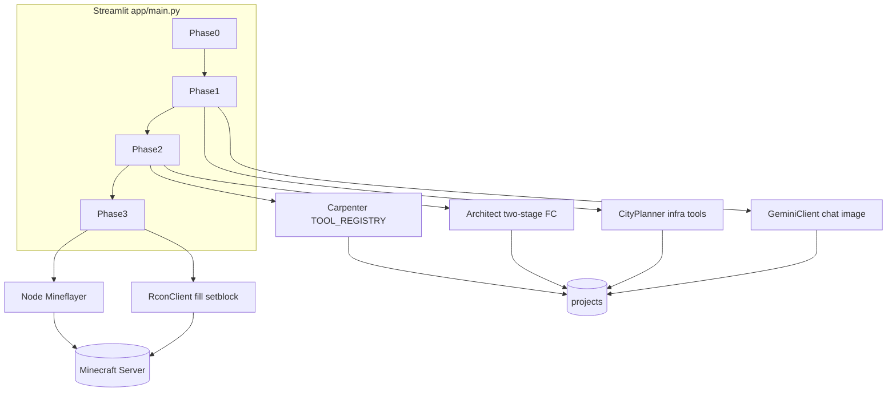

# Bananacraft Core — リポジトリ設計書（開発者向け）

本書はコードベース上の責務分担・データの流れ・改修時の着手点をまとめたものです。背景やプロダクト思想は [Zenn: Bananacraft の記事](https://zenn.dev/nakaniship/articles/9f6eb4b7f8a44e) を参照してください（本書はその「実装マップ」役）。

---

## 目次

1. [目的とスコープ](#1-目的とスコープ)
2. [システム構成](#2-システム構成)
3. [Streamlit の Phase 設計](#3-streamlit-の-phase-設計)
4. [ディレクトリと主要モジュール](#4-ディレクトリと主要モジュール)
5. [プロジェクト成果物（`projects/`）](#5-プロジェクト成果物projects)
6. [v2 建築パイプライン](#6-v2-建築パイプライン)
7. [Mineflayer ボット](#7-mineflayer-ボット)
8. [環境変数](#8-環境変数)
9. [デプロイと運用](#9-デプロイと運用)
10. [拡張・改修ガイド](#10-拡張改修ガイド)
11. [レガシー・周辺コード](#11-レガシー周辺コード)
12. [用語メモ](#12-用語メモ)

---

## 1. 目的とスコープ

- 本リポジトリは **GCE 向けに整理された Bananacraft（デプロイ版）** です（[README.md](../README.md) の通り、レガシー削減済み）。
- **ユーザー向け操作手順**は README に集約。**本書は開発者が Phase・モジュール・JSON 成果物を追い、手直しするための設計参照**です。

---

## 2. システム構成

| 要素 | 技術・実装の所在 |
|------|------------------|
| フロント／オーケストレーション | Streamlit — [app/main.py](../app/main.py) のみ |
| LLM・画像生成 | Google Gen AI — [app/api_client.py](../app/api_client.py)、建築・インフラは [app/v2/architect.py](../app/v2/architect.py)、[app/v2/city_planner.py](../app/v2/city_planner.py)、[app/v2/decorator.py](../app/v2/decorator.py) |
| 設計図 → ボクセル | [app/v2/carpenter.py](../app/v2/carpenter.py) + [app/v2/tools/](../app/v2/tools/) |
| 即時ワールド反映 | Minecraft RCON — [app/rcon_client.py](../app/rcon_client.py) |
| 逐次設置（演出） | Mineflayer — [AI_Carpenter_Bot/index.js](../AI_Carpenter_Bot/index.js) |
| プロジェクト保存 | [app/file_manager.py](../app/file_manager.py) → `projects/<プロジェクト名>/` |

---

## 3. Streamlit の Phase 設計

状態は `st.session_state.phase`（整数）で管理されます。

| Phase | 画面の主旨 | 主に触るコード | 備考 |
|-------|------------|----------------|------|
| **0** | 新規プロジェクト作成、API キー確認 | [app/main.py](../app/main.py) 冒頭〜 `phase == 0` | `FileManager`、`GeminiClient`、`Architect` を初期化。既存 `concept_*` / `zoning_*` があれば復元して **1 へ** |
| **1** | コンセプトアート、ゾーニング、インフラ、テラフォーム | `phase == 1` | `GeminiClient` のチャット／画像、`CityPlanner`、`zoning_fixer` 経由の調整、任意で `Terraformer` |
| **2** | 区画（ゾーン）を 1 つ選び、外観画像 → 設計図（JSON）→ ブロック列 | `phase == 2` | `selected_zone`、`Architect.analyze_structure` / `generate_from_structure`、`CarpenterSession`、`BlueprintAnalyzer`（プレビュー）、3D は [app/v2/preview.py](../app/v2/preview.py) |
| **3** | 構造物の RCON 一括建築、クリア、装飾プラン生成、Mineflayer 実行 | `phase == 3` | `RconClient.build_voxels`、`Decorator`、`CarpenterSession.run_bot` |

**戻る操作**: Phase 3 から建物一覧へは `phase = 1`。Phase 3 で設計に戻るボタンは `phase = 2`。

---

## 4. ディレクトリと主要モジュール

| パス | 役割 |
|------|------|
| [app/main.py](../app/main.py) | UI・Phase 分岐・成果物の読み書きの集約点 |
| [app/api_client.py](../app/api_client.py) | コンセプト用チャット、テキスト／画像生成。`TEXT_MODEL` / `IMAGE_MODEL` 等の定数 |
| [app/rcon_client.py](../app/rcon_client.py) | `SimpleRcon`（プロトコル）、`RconClient`（`fill` / `setblock` バッチ、`build_voxels`） |
| [app/file_manager.py](../app/file_manager.py) | `projects/<name>/` への JSON・テキスト・画像の保存読込 |
| [app/v2/architect.py](../app/v2/architect.py) | 建築用 Function Calling スキーマ `TOOL_DECLARATIONS`、2 段階解析、`BuildingInstruction` |
| [app/v2/carpenter.py](../app/v2/carpenter.py) | ツール実行エンジン、`CarpenterSession.run_bot`（Node 起動） |
| [app/v2/tools/](../app/v2/tools/) | 各ツール実装と [__init__.py の `TOOL_REGISTRY`](../app/v2/tools/__init__.py) |
| [app/v2/blueprint_analyzer.py](../app/v2/blueprint_analyzer.py) | 建築指示 JSON から壁・屋根・窓などの意味要素へ分解（装飾・解析用） |
| [app/v2/decorator.py](../app/v2/decorator.py) | 装飾プラン生成（Gemini + `decorate_element` 系） |
| [app/v2/city_planner.py](../app/v2/city_planner.py) | ゾーニング結果から道路・広場等 `INFRA_TOOLS` |
| [app/v2/zoning_fixer.py](../app/v2/zoning_fixer.py) | 区画 JSON の衝突検出・修正 |
| [app/v2/layout_engine.py](../app/v2/layout_engine.py) | レイアウト計算（ゾーン座標などと連携） |
| [app/v2/geometry/](../app/v2/geometry/) | ベジェ、階段、ボクセル化など幾何サブルーチン |
| [AI_Carpenter_Bot/](../AI_Carpenter_Bot/) | Mineflayer クライアント、`package.json` で依存管理 |
| [deployment/](../deployment/) | systemd ユニット例 |
| [setup.sh](../setup.sh) | 環境セットアップ |

---

## 5. プロジェクト成果物（`projects/`）

ルートは `FileManager(..., base_dir="projects")` により **`projects/<プロジェクト名>/`** です（Streamlit のカレントがリポジトリルートであることが前提。サービスファイルの `WorkingDirectory` と一致させる）。

### 5.1 グローバル（プロジェクト全体）

| ファイル | 読む側 | 書く側 | 内容の概要 |
|----------|--------|--------|--------------|
| `project_config.json` | main（サイドバー・Phase3） | main | `origin` 等ワールド基準座標 |
| `concept_input.txt` | （主に記録） | main | ユーザー入力 |
| `concept_reasoning.txt` | main、Decorator | main | コンセプト推敲の説明 |
| `concept_prompt_refined.txt` | main（復元） | main | 画像生成用プロンプト |
| `concept_art.jpg` | main、Phase2 参照 | main | コンセプト画像 |
| `concept_feedback_<timestamp>.txt` 等 | 記録 | main | フィードバックループ時 |
| `concept_art_<timestamp>.jpg` | 記録 | main | 同上 |
| `zoning_data.json` | main、CityPlanner、復元 | main / 修正フロー | 初期ゾーニング |
| `zoning_adjusted.json` | main（優先読込） | 衝突修正後 | 調整済みゾーニング |
| `infrastructure.json` | main | CityPlanner 実行後 | 道路・広場等のインフラ指示 |

### 5.2 ゾーン単位（`zone['id']` を `<id>` と表記）

| ファイル | 読む側 | 書く側 | 内容の概要 |
|----------|--------|--------|--------------|
| `design_<id>_decorated.jpg` | main、Decorator | main | 装飾込み外観 |
| `design_<id>_structure.jpg` | Architect Stage1 | main | 構造用外観 |
| `design_<id>_dec_<timestamp>.jpg` | main | main | 再生成時の装飾画像 |
| `building_<id>_instructions.json` | main、Analyzer、Decorator、Carpenter | Architect 経由で main | **ツール呼び出し列**（建築設計図） |
| `building_<id>_blocks_v2.json` | main、RCON、Decorator | Carpenter 経由で main | **相対座標のブロック列**（v2） |
| `building_<id>_decoration.json` | main（表示・ボット準備） | Decorator 経由で main | 装飾用のツール呼び出し列（JSON 配列として保存） |
| `bot_instructions_<id>.json` | Node ボット | main Phase3 | `{"instructions": [ {x,y,z,action,block}, ... ] }` 形式 |
| `full_build.json` | RCON／ボット例 | main（Merge ボタン） | 構造＋装飾をマージした `instructions` |
| `decoration.json` | main の一部 UI、手動コマンド例 | 別フローで配置した場合 | マージ UI は存在時のみ表示 |

**座標の考え方**: Phase3 の即時建築では `project_config.json` の `origin` と、選択ゾーンの `position.x` / `position.z` を足した **`build_origin`** を RCON に渡し、`building_*_blocks_v2.json` 内の相対座標と合成されます（`main.py` 内コメント参照）。

### 5.3 JSON のトップレベル形

[app/file_manager.py](../app/file_manager.py) の `save_json` は型注釈こそ `dict` だが、実装は `json.dump(data, ...)` のため **`list` をそのまま保存**できる。`infrastructure.json` および `building_<id>_decoration.json` は **指示オブジェクトの配列**として保存される。一方 `bot_instructions_<id>.json` や `full_build.json` は **`{"instructions": [...]}`** 形式で、Mineflayer 側の読み込み形式と一致させている。

---

## 6. v2 建築パイプライン

### 6.1 Architect（[app/v2/architect.py](../app/v2/architect.py)）

- **Stage 1**: 構造画像を入力に、建物を言語化した JSON（コンポーネント列）へ。`temperature=0.3` 前後で精度重視。
- **Stage 2**: Stage1 の JSON から **Function Calling** で `TOOL_DECLARATIONS` に沿った呼び出しへ。`temperature=0.5` 前後。
- デフォルトモデルは **`gemini-3-pro-preview`**（`Architect.model_name`）。別モデルに差し替える場合はここと [app/api_client.py](../app/api_client.py) の定数の整合を確認。
- **`VALID_BLOCKS`**: `draw_plane` 等の `enum` と一致させる。ブロック ID を増やすときはここと各ツール内の許容マテリアルも確認。

### 6.2 Carpenter と `TOOL_REGISTRY`

- [app/v2/carpenter.py](../app/v2/carpenter.py) が `TOOL_REGISTRY` からインスタンス化し、`execute(params, origin)` でブロック辞書列を生成。
- 同一座標は **後勝ち**（`block_map` で上書き）。
- `BlueprintAnalyzer` をコンストラクト時に注入すると、`set_analyzer` 対応ツールへ文脈が渡る。

### 6.3 CityPlanner（[app/v2/city_planner.py](../app/v2/city_planner.py)）

- `INFRA_TOOLS`（`draw_road`, `fill_zone`, `place_street_decor`）専用のスキーマ。建築ツール群とは別定義なので、**インフラ用の新ツールは `INFRA_TOOLS` と `TOOL_REGISTRY` の両方**が必要。

### 6.4 Decorator と BlueprintAnalyzer

- [app/v2/blueprint_analyzer.py](../app/v2/blueprint_analyzer.py): `draw_plane` / `place_window` / `place_door` 等から要素 ID・向き・範囲を構築。
- [app/v2/decorator.py](../app/v2/decorator.py): 完成イメージ画像＋コンセプト＋構造指示から装飾用の Function Calling を生成。API キーは `GEMINI_API_KEY`。

---

## 7. Mineflayer ボット

- 実装: [AI_Carpenter_Bot/index.js](../AI_Carpenter_Bot/index.js)
- **接続先**: `host: 'localhost'`, `port: 25565` にハードコード。リモートサーバや別ポートのときはコード変更が必要。
- **引数**: `node index.js <PROJECT_NAME> [OriginX OriginY OriginZ] [FILENAME]`
- **入力ファイル**: `../projects/<PROJECT_NAME>/<FILENAME>`（既定 `decoration.json`）。中身は **`{ "instructions": [ ... ] }`** を想定。各要素は少なくとも `setblock` 用の `x,y,z,block`（および `action`）形式。
- Streamlit からは [app/v2/carpenter.py](../app/v2/carpenter.py) の `CarpenterSession.run_bot` が `cwd=AI_Carpenter_Bot` で `subprocess` 実行。

---

## 8. 環境変数

| 変数 | 用途 |
|------|------|
| `GEMINI_API_KEY` | Gemini 全般（必須） |
| `RCON_HOST` | 既定 `localhost` — [app/rcon_client.py](../app/rcon_client.py) |
| `RCON_PORT` | 既定 `25575` |
| `RCON_PASSWORD` | RCON ログイン |
| `STREAMLIT_PASSWORD` | 設定時のみログイン gate — [app/main.py](../app/main.py) `check_password` |

テンプレート: [.env.example](../.env.example)。systemd では `EnvironmentFile=` で `.env` を読み込む構成になっている（[deployment/bananacraft.service](../deployment/bananacraft.service)）。

---

## 9. デプロイと運用

- **Docker Compose**（推奨・ローカル検証や単一ホスト運用）: リポジトリルートの [Dockerfile](../Dockerfile) と [docker-compose.yml](../docker-compose.yml)。`docker compose up --build -d` で Streamlit を `http://localhost:8501` に公開。`./projects` をボリュームマウント。ホスト上の Minecraft RCON へは `RCON_HOST=host.docker.internal`（Linux は compose の `extra_hosts` 済み）を参照。
- [setup.sh](../setup.sh): 仮想環境・依存関係・Streamlit 等の一括セットアップ。
- [deployment/bananacraft.service](../deployment/bananacraft.service): `streamlit run app/main.py --server.port 8501`。`User` / `WorkingDirectory` / `ExecStart` のパスは **実環境のユーザー名に合わせて編集**すること。
- [deployment/minecraft.service](../deployment/minecraft.service): Minecraft サーバ用（同様にパス調整）。
- Minecraft 側では `server.properties` で RCON を有効化し、`.env` のパスワードと一致させる（README 参照）。

---

## 10. 拡張・改修ガイド

### 10.1 新建築ツール（構造物）を追加する場合

1. [app/v2/tools/](../app/v2/tools/) に新クラスを追加し、`execute(params, origin)` がブロック辞書を返すようにする。
2. [app/v2/tools/__init__.py](../app/v2/tools/__init__.py) の `TOOL_REGISTRY` に **Python 側のツール名**を登録。
3. [app/v2/architect.py](../app/v2/architect.py) の `TOOL_DECLARATIONS` に **同一ツール名**で JSON Schema を追加（Gemini がこの名前で呼び出す）。
4. ブロック型を `enum` で縛る場合は **`VALID_BLOCKS`** とスキーマの `enum` を同期。

**注意**: スキーマは Architect、実行は Carpenter と **二重定義**になる。片方だけ更新すると実行時エラーまたは無視されるので、変更チェックリストに両方を入れる。

### 10.2 インフラ専用ツールを追加する場合

- [app/v2/city_planner.py](../app/v2/city_planner.py) の `INFRA_TOOLS` に宣言を追加。
- 実行クラスを [app/v2/tools/](../app/v2/tools/) に実装し `TOOL_REGISTRY` に登録（既存の `DrawRoadTool` 等と同様）。

### 10.3 モデル・生成パラメータ

- 会話・コンセプト画像: [app/api_client.py](../app/api_client.py)
- 建築解析・FC: [app/v2/architect.py](../app/v2/architect.py) の `generate_content` 各所の `temperature` / `model`
- 都市インフラ: [app/v2/city_planner.py](../app/v2/city_planner.py)

### 10.4 UI／Phase の変更

- Phase 番号・遷移・保存ファイル名はすべて [app/main.py](../app/main.py) に直書き。新 Phase や新成果物を足す場合は **grep で `fm.save` / `fm.load` を洗い出す**と漏れが防げる。

### 10.5 RCON の制約

- `fill` のボリューム上限対策として、クリア処理ではチャンク分割・`forceload` を使用（`main.py` Phase3）。大規模建築コマンドを追加する際は同様の制限に注意。

---

## 11. レガシー・周辺コード

現行の主導線は **v2 + Streamlit + RCON +（任意で）Mineflayer** です。次のモジュールは **過去実験・補助・未使用 import** が混在します。改修の優先度を下げるか、触る前に `main.py` から参照されているか grep してください。

| モジュール | メモ |
|------------|------|
| [app/meshy_client.py](../app/meshy_client.py) | `main.py` は import のみで本流 UI からは未使用の可能性大 |
| [app/voxelizer/](../app/voxelizer/)、[app/voxelizer.py](../app/voxelizer.py)、[app/advanced_voxelizer.py](../app/advanced_voxelizer.py) | メッシュ→ボクセル系。記事で言及の「3D メッシュ経由」ルートの名残 |
| [app/decorator.py](../app/decorator.py)（v2 以外） | v2 の [app/v2/decorator.py](../app/v2/decorator.py) と名前が衝突しやすい。UI は v2 を import |
| [app/gemini_refiner.py](../app/gemini_refiner.py)、[app/sample.py](../app/sample.py)、[app/compare_voxelizers.py](../app/compare_voxelizers.py) | ユーティリティ／検証用 |
| [app/facade.py](../app/facade.py) | 立面抽出など。主線からは独立 |

`Terraformer` は **Phase1 サイドバー**から呼ばれ、200x200 クリア等に使用（[app/terraformer.py](../app/terraformer.py)）。

---

## 12. 用語メモ

| 用語 | 本リポジトリでの意味 |
|------|---------------------|
| Phase | Streamlit の大ステップ（0〜3） |
| Zoning | `zoning_data.json` / `zoning_adjusted.json` の建物区画リスト |
| Blueprint | `building_<id>_instructions.json`（ツール呼び出しの列） |
| Carpenter | ツールを実行してブロック列へ落とすエンジン |
| v2 blocks | `building_<id>_blocks_v2.json`（RCON `build_voxels` 向け） |
| AI Carpenter Bot | Mineflayer で `setblock` を順次実行する Node プロセス |

---

## 改訂時のチェックリスト

- [ ] `main.py` の `phase` 分岐と成果物表に矛盾がないか
- [ ] 新ツール追加時、`architect.TOOL_DECLARATIONS` と `TOOL_REGISTRY` の双方を更新したか
- [ ] `VALID_BLOCKS`（および各ツールのマテリアル制約）を更新したか
- [ ] `.env.example` と README の記述を更新したか（新しい環境変数がある場合）
- [ ] systemd の `WorkingDirectory` が `projects/` 相対パスと整合するか
