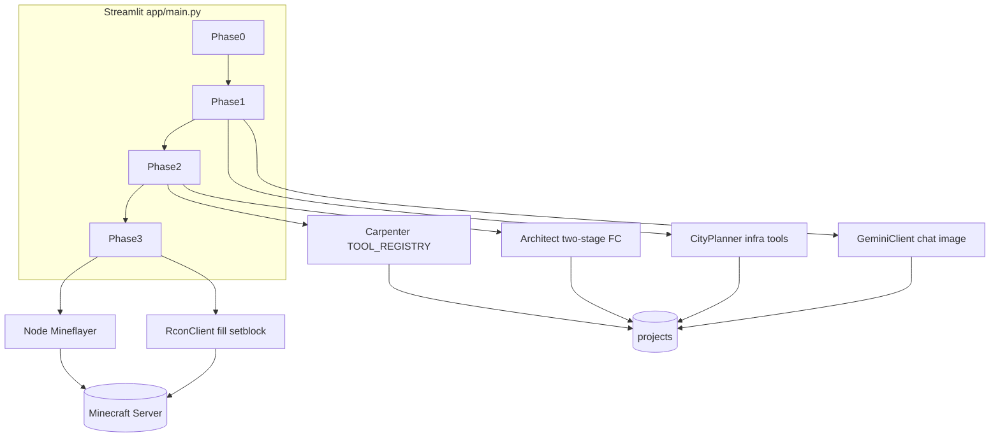
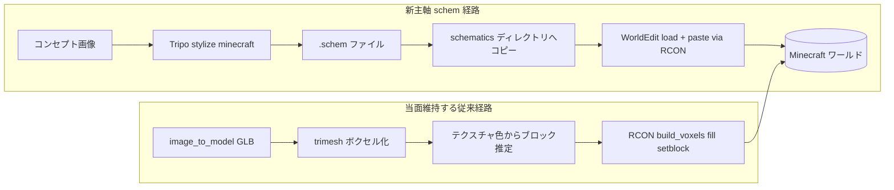
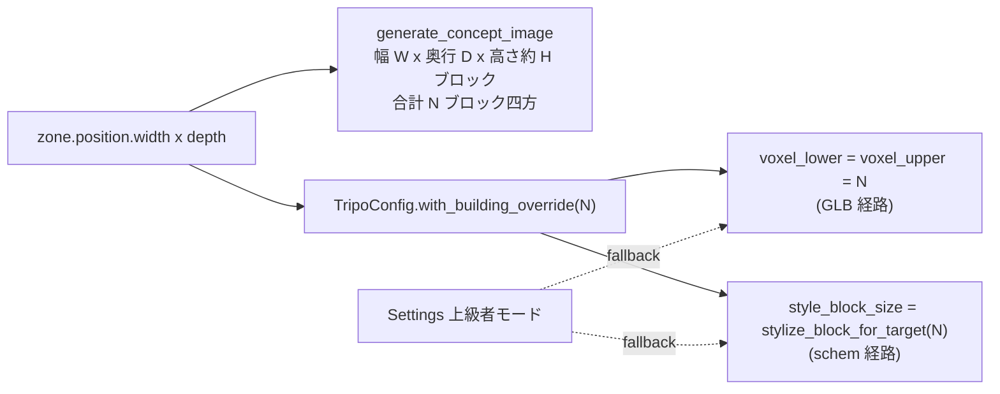

# Bananacraft Core — リポジトリ設計書（開発者向け）

本書はコードベース上の責務分担・データの流れ・改修時の着手点をまとめたものです。背景やプロダクト思想は [Zenn: Bananacraft の記事](https://zenn.dev/nakaniship/articles/9f6eb4b7f8a44e) を参照してください（本書はその「実装マップ」役）。

> **Tripo / Minecraft ノウハウ**  
> [TRIPO_MINECRAFT.md](./TRIPO_MINECRAFT.md) — Path A/B 比較、block_size、トラブルシュート。

> **既知の課題（最優先: ゾーンと schem のサイズ不一致）**  
> [KNOWN_CHALLENGES.md](./KNOWN_CHALLENGES.md) — Agent / 開発者は Tripo・Blueprint 改修前に必読。

---

## 目次

1. [目的とスコープ](#1-目的とスコープ)
2. [システム構成](#2-システム構成)
3. [Streamlit の Phase 設計](#3-streamlit-の-phase-設計)
4. [ディレクトリと主要モジュール](#4-ディレクトリと主要モジュール)
5. [プロジェクト成果物（`projects/`）](#5-プロジェクト成果物projects)
6. [v2 建築パイプライン](#6-v2-建築パイプライン)
7. [Mineflayer ボット](#7-mineflayer-ボット)
8. [環境変数](#8-環境変数)
9. [デプロイと運用](#9-デプロイと運用)
10. [拡張・改修ガイド](#10-拡張改修ガイド)
11. [レガシー・周辺コード](#11-レガシー周辺コード)
12. [用語メモ](#12-用語メモ)
13. [製品方針: Tripo `.schem` と WorldEdit 配置](#13-製品方針-tripo-schem-と-worldedit-配置)

---

## 1. 目的とスコープ

- 本リポジトリは **GCE 向けに整理された Bananacraft（デプロイ版）** です（[README.md](../README.md) の通り、レガシー削減済み）。
- **ユーザー向け操作手順**は README に集約。**本書は開発者が Phase・モジュール・JSON 成果物を追い、手直しするための設計参照**です。

---

## 2. システム構成

| 要素 | 技術・実装の所在 |
|------|------------------|
| フロント／オーケストレーション | Streamlit — [app/main.py](../app/main.py) のみ |
| LLM・画像生成 | **工程別ルーティング** — [app/ai/routing.py](../app/ai/routing.py)、[app/ai/key_store.py](../app/ai/key_store.py)、[app/ai/providers/stage_client.py](../app/ai/providers/stage_client.py)。既定は OpenAI（区画・建築 FC 等）・Anthropic（コンセプト・装飾）・Google（画像）。キー不足時は Gemini にフォールバック。UI からのキーは [app/ai/browser_keys.py](../app/ai/browser_keys.py) で localStorage と同期。 |
| 設計図 → ボクセル | [app/v2/carpenter.py](../app/v2/carpenter.py) + [app/v2/tools/](../app/v2/tools/) |
| 即時ワールド反映 | Minecraft RCON — [app/rcon_client.py](../app/rcon_client.py) |
| 逐次設置（演出） | Mineflayer — [AI_Carpenter_Bot/index.js](../AI_Carpenter_Bot/index.js) |
| プロジェクト保存 | [app/file_manager.py](../app/file_manager.py) → `projects/<プロジェクト名>/` |



---

## 3. Streamlit の Phase 設計

状態は `st.session_state.phase`（整数）で管理されます。

| Phase | 画面の主旨 | 主に触るコード | 備考 |
|-------|------------|----------------|------|
| **0** | 新規プロジェクト作成、API キー確認 | [app/main.py](../app/main.py) 冒頭〜 `phase == 0` | `FileManager`、`GeminiClient`、`Architect` を初期化。既存 `concept_*` / `zoning_*` があれば復元して **1 へ** |
| **1** | コンセプトアート、ゾーニング、インフラ、テラフォーム | `phase == 1` | `GeminiClient` のチャット／画像、`CityPlanner`、`zoning_fixer` 経由の調整、任意で `Terraformer` |
| **2** | 区画（ゾーン）を 1 つ選び、外観画像 → 設計図（JSON）→ ブロック列 | `phase == 2` | `selected_zone`、`Architect.analyze_structure` / `generate_from_structure`、`CarpenterSession`、`BlueprintAnalyzer`（プレビュー）、3D は [app/v2/preview.py](../app/v2/preview.py) |
| **3** | 構造物の RCON 一括建築、クリア、装飾プラン生成、Mineflayer 実行 | `phase == 3` | `RconClient.build_voxels`、`Decorator`、`CarpenterSession.run_bot` |

**戻る操作**: Phase 3 から建物一覧へは `phase = 1`。Phase 3 で設計に戻るボタンは `phase = 2`。

---

## 4. ディレクトリと主要モジュール

| パス | 役割 |
|------|------|
| [app/main.py](../app/main.py) | UI・Phase 分岐・成果物の読み書きの集約点 |
| [app/api_client.py](../app/api_client.py) | コンセプト用チャット／画像／区画 JSON。内部で `ai.routing` の工程に応じたプロバイダを利用 |
| [app/ai/routing.py](../app/ai/routing.py) | `AIStage` ごとのプロバイダ（Google / OpenAI / Anthropic）とモデル ID の固定割当 |
| [app/ai/key_store.py](../app/ai/key_store.py) | ランタイム上の API キー辞書（Streamlit session / localStorage 由来が `.env` より優先） |
| [app/ai/browser_keys.py](../app/ai/browser_keys.py) | `streamlit-js-eval` 経由で localStorage 読み書き |
| [app/ai/providers/stage_client.py](../app/ai/providers/stage_client.py) | `complete_json` / `complete_text` / `complete_with_tools` / `generate_image_bytes` の実装 |
| [app/rcon_client.py](../app/rcon_client.py) | `SimpleRcon`（プロトコル）、`RconClient`（`fill` / `setblock` バッチ、`build_voxels`） |
| [app/file_manager.py](../app/file_manager.py) | `projects/<name>/` への JSON・テキスト・画像の保存読込 |
| [app/v2/architect.py](../app/v2/architect.py) | 建築用 Function Calling スキーマ `TOOL_DECLARATIONS`、2 段階解析、`BuildingInstruction` |
| [app/v2/carpenter.py](../app/v2/carpenter.py) | ツール実行エンジン、`CarpenterSession.run_bot`（Node 起動） |
| [app/v2/tools/](../app/v2/tools/) | 各ツール実装と [__init__.py の `TOOL_REGISTRY`](../app/v2/tools/__init__.py) |
| [app/v2/blueprint_analyzer.py](../app/v2/blueprint_analyzer.py) | 建築指示 JSON から壁・屋根・窓などの意味要素へ分解（装飾・解析用） |
| [app/v2/decorator.py](../app/v2/decorator.py) | 装飾プラン生成（Gemini + `decorate_element` 系） |
| [app/v2/city_planner.py](../app/v2/city_planner.py) | ゾーニング結果から道路・広場等 `INFRA_TOOLS` |
| [app/v2/zoning_fixer.py](../app/v2/zoning_fixer.py) | 区画 JSON の衝突検出・修正 |
| [app/v2/layout_engine.py](../app/v2/layout_engine.py) | レイアウト計算（ゾーン座標などと連携） |
| [app/v2/geometry/](../app/v2/geometry/) | ベジェ、階段、ボクセル化など幾何サブルーチン |
| [AI_Carpenter_Bot/](../AI_Carpenter_Bot/) | Mineflayer クライアント、`package.json` で依存管理 |
| [deployment/](../deployment/) | systemd ユニット例 |
| [setup.sh](../setup.sh) | 環境セットアップ |

---

## 5. プロジェクト成果物（`projects/`）

ルートは `FileManager(..., base_dir="projects")` により **`projects/<プロジェクト名>/`** です（Streamlit のカレントがリポジトリルートであることが前提。サービスファイルの `WorkingDirectory` と一致させる）。

### 5.1 グローバル（プロジェクト全体）

| ファイル | 読む側 | 書く側 | 内容の概要 |
|----------|--------|--------|--------------|
| `project_config.json` | main（サイドバー・Phase3） | main | `origin` 等ワールド基準座標 |
| `concept_input.txt` | （主に記録） | main | ユーザー入力 |
| `concept_reasoning.txt` | main、Decorator | main | コンセプト推敲の説明 |
| `concept_prompt_refined.txt` | main（復元） | main | 画像生成用プロンプト |
| `concept_art.jpg` | main、Phase2 参照 | main | コンセプト画像 |
| `concept_feedback_<timestamp>.txt` 等 | 記録 | main | フィードバックループ時 |
| `concept_art_<timestamp>.jpg` | 記録 | main | 同上 |
| `zoning_data.json` | main、CityPlanner、復元 | main / 修正フロー | 初期ゾーニング |
| `zoning_adjusted.json` | main（優先読込） | 衝突修正後 | 調整済みゾーニング |
| `infrastructure.json` | main | CityPlanner 実行後 | 道路・広場等のインフラ指示 |

### 5.2 ゾーン単位（`zone['id']` を `<id>` と表記）

| ファイル | 読む側 | 書く側 | 内容の概要 |
|----------|--------|--------|--------------|
| `design_<id>_decorated.jpg` | main、Decorator | main | 装飾込み外観 |
| `design_<id>_structure.jpg` | Architect Stage1 | main | 構造用外観 |
| `design_<id>_dec_<timestamp>.jpg` | main | main | 再生成時の装飾画像 |
| `building_<id>_instructions.json` | main、Analyzer、Decorator、Carpenter | Architect 経由で main | **ツール呼び出し列**（建築設計図） |
| `building_<id>_blocks_v2.json` | main、RCON、Decorator | Carpenter 経由で main | **相対座標のブロック列**（v2） |
| `building_<id>_decoration.json` | main（表示・ボット準備） | Decorator 経由で main | 装飾用のツール呼び出し列（JSON 配列として保存） |
| `bot_instructions_<id>.json` | Node ボット | main Phase3 | `{"instructions": [ {x,y,z,action,block}, ... ] }` 形式 |
| `full_build.json` | RCON／ボット例 | main（Merge ボタン） | 構造＋装飾をマージした `instructions` |
| `decoration.json` | main の一部 UI、手動コマンド例 | 別フローで配置した場合 | マージ UI は存在時のみ表示 |

**座標の考え方**: Phase3 の即時建築では `project_config.json` の `origin` と、選択ゾーンの `position.x` / `position.z` を足した **`build_origin`** を RCON に渡し、`building_*_blocks_v2.json` 内の相対座標と合成されます（`main.py` 内コメント参照）。

### 5.3 JSON のトップレベル形

[app/file_manager.py](../app/file_manager.py) の `save_json` は型注釈こそ `dict` だが、実装は `json.dump(data, ...)` のため **`list` をそのまま保存**できる。`infrastructure.json` および `building_<id>_decoration.json` は **指示オブジェクトの配列**として保存される。一方 `bot_instructions_<id>.json` や `full_build.json` は **`{"instructions": [...]}`** 形式で、Mineflayer 側の読み込み形式と一致させている。

---

## 6. v2 建築パイプライン

### 6.1 Architect（[app/v2/architect.py](../app/v2/architect.py)）

- **Stage 1**: 構造画像を入力に、建物を言語化した JSON（コンポーネント列）へ。`temperature=0.3` 前後で精度重視。
- **Stage 2**: Stage1 の JSON から **Function Calling** で `TOOL_DECLARATIONS` に沿った呼び出しへ。`temperature=0.5` 前後。
- 既定の LLM は [app/ai/routing.py](../app/ai/routing.py) の `ROUTES` で工程ごとに固定（例: OpenAI `gpt-5.5`、Anthropic `claude-sonnet-4-6`、フォールバック時の Gemini `gemini-3-pro-preview`）。変更する場合は同ファイルと [app/api_client.py](../app/api_client.py) 先頭の `TEXT_MODEL` / `IMAGE_MODEL`（`text_model` / `image_model` の再エクスポート）の整合を確認。
- **`VALID_BLOCKS`**: `draw_plane` 等の `enum` と一致させる。ブロック ID を増やすときはここと各ツール内の許容マテリアルも確認。

### 6.2 Carpenter と `TOOL_REGISTRY`

- [app/v2/carpenter.py](../app/v2/carpenter.py) が `TOOL_REGISTRY` からインスタンス化し、`execute(params, origin)` でブロック辞書列を生成。
- 同一座標は **後勝ち**（`block_map` で上書き）。
- `BlueprintAnalyzer` をコンストラクト時に注入すると、`set_analyzer` 対応ツールへ文脈が渡る。

### 6.3 CityPlanner（[app/v2/city_planner.py](../app/v2/city_planner.py)）

- `INFRA_TOOLS`（`draw_road`, `fill_zone`, `place_street_decor`）専用のスキーマ。建築ツール群とは別定義なので、**インフラ用の新ツールは `INFRA_TOOLS` と `TOOL_REGISTRY` の両方**が必要。

### 6.4 Decorator と BlueprintAnalyzer

- [app/v2/blueprint_analyzer.py](../app/v2/blueprint_analyzer.py): `draw_plane` / `place_window` / `place_door` 等から要素 ID・向き・範囲を構築。
- [app/v2/decorator.py](../app/v2/decorator.py): 完成イメージ画像＋コンセプト＋構造指示から装飾用の Function Calling を生成。API キーは `GEMINI_API_KEY`。

---

## 7. Mineflayer ボット

- 実装: [AI_Carpenter_Bot/index.js](../AI_Carpenter_Bot/index.js)
- **接続先**: 環境変数 `MC_HOST`（既定 `localhost`）、`MC_PORT`（既定 **28888**）— [AI_Carpenter_Bot/index.js](../AI_Carpenter_Bot/index.js)。`run_bot` は親の `os.environ` を subprocess に渡す。
- **引数**: `node index.js <PROJECT_NAME> [OriginX OriginY OriginZ] [FILENAME]`
- **入力ファイル**: `../projects/<PROJECT_NAME>/<FILENAME>`（既定 `decoration.json`）。中身は **`{ "instructions": [ ... ] }`** を想定。各要素は少なくとも `setblock` 用の `x,y,z,block`（および `action`）形式。
- Streamlit からは [app/v2/carpenter.py](../app/v2/carpenter.py) の `CarpenterSession.run_bot` が `cwd=AI_Carpenter_Bot` で `subprocess` 実行。

---

## 8. 環境変数

### 8.1 API キーの解決順（重要）

1. **Streamlit セッション**（サイドバー入力で更新される `api_key_context`）  
2. **ブラウザ localStorage**（初回ロード時に `streamlit-js-eval` で読み込み、任意で「ブラウザに保存」）  
3. **OS 環境変数**（`.env` / systemd の `EnvironmentFile`）

`localStorage` に保存したキーは **同一オリジン上で悪意のあるスクリプト（XSS）が実行されると読み取られる**可能性があります。本番ではサーバ側シークレット管理や、バックエンドプロキシ経由でのみ LLM を呼ぶ構成を推奨します。CSP（Content-Security-Policy）の強化や、信頼できない `components` の禁止も有効です。

### 8.2 変数一覧

| 変数 | 用途 |
|------|------|
| `GEMINI_API_KEY` | 画像生成（必須寄り）および OpenAI/Anthropic 未設定時の **全工程フォールバック** |
| `OPENAI_API_KEY` | 区画 JSON・躯体画像解析・建築 FC・インフラ FC（未設定時は Gemini に切替） |
| `ANTHROPIC_API_KEY` | コンセプト対話・装飾 FC（未設定時は Gemini） |
| `RCON_HOST` | 既定 `localhost` — [app/rcon_client.py](../app/rcon_client.py) |
| `RCON_PORT` | 既定 **28889**（Docker MC のホスト公開ポート） |
| `MC_HOST` / `MC_PORT` | Mineflayer ボット接続先（既定 `localhost` / **28888**） |
| `RCON_PASSWORD` | RCON ログイン |
| `STREAMLIT_PASSWORD` | 設定時のみログイン gate — [app/main.py](../app/main.py) `check_password` |

モデル ID の選定根拠（Function Calling 比較）の一例: [Berkeley Function Calling Leaderboard](https://gorilla.cs.berkeley.edu/leaderboard.html)。実装では `routing.py` の定数を製品方針として固定し、四半期などの周期で見直す運用を推奨します。

テンプレート: [.env.example](../.env.example)。systemd では `EnvironmentFile=` で `.env` を読み込む構成になっている（[deployment/bananacraft.service](../deployment/bananacraft.service)）。

---

## 9. デプロイと運用

- [setup.sh](../setup.sh): 仮想環境・依存関係・Streamlit 等の一括セットアップ。
- [docker-compose.yml](../docker-compose.yml): **`minecraft`**（Purpur **26.1.2**、フラット、Modrinth: WorldEdit、任意で BlueMap、ホスト **28888** / **28889** / 任意 **8100**）と **`bananacraft`**。UI コンテナは `RCON_HOST=minecraft` で compose 内 DNS を使い、`./minecraft-data` を `/minecraft-data` にマウントして WorldEdit の schematics ディレクトリを共有する。[Makefile](../Makefile): `make up` / `make down` / `make logs` / `make attach` / `make reset` / `make dev`（ホスト Streamlit）。
- [minecraft/README.md](../minecraft/README.md): ポート・プラグイン・移行手順。
- [deployment/bananacraft.service](../deployment/bananacraft.service): `streamlit run app/main.py --server.port 8501`。`User` / `WorkingDirectory` / `ExecStart` のパスは **実環境のユーザー名に合わせて編集**すること。
- [deployment/minecraft.service](../deployment/minecraft.service): 手動 `server.jar` 運用用（Docker を使う場合は不要）。
- RCON: `.env` の `RCON_PASSWORD` を Docker MC（itzg）または手動 `server.properties` と一致させる。

---

## 10. 拡張・改修ガイド

### 10.1 新建築ツール（構造物）を追加する場合

1. [app/v2/tools/](../app/v2/tools/) に新クラスを追加し、`execute(params, origin)` がブロック辞書を返すようにする。
2. [app/v2/tools/__init__.py](../app/v2/tools/__init__.py) の `TOOL_REGISTRY` に **Python 側のツール名**を登録。
3. [app/v2/architect.py](../app/v2/architect.py) の `TOOL_DECLARATIONS` に **同一ツール名**で JSON Schema を追加（Gemini がこの名前で呼び出す）。
4. ブロック型を `enum` で縛る場合は **`VALID_BLOCKS`** とスキーマの `enum` を同期。

**注意**: スキーマは Architect、実行は Carpenter と **二重定義**になる。片方だけ更新すると実行時エラーまたは無視されるので、変更チェックリストに両方を入れる。

### 10.2 インフラ専用ツールを追加する場合

- [app/v2/city_planner.py](../app/v2/city_planner.py) の `INFRA_TOOLS` に宣言を追加。
- 実行クラスを [app/v2/tools/](../app/v2/tools/) に実装し `TOOL_REGISTRY` に登録（既存の `DrawRoadTool` 等と同様）。

### 10.3 モデル・生成パラメータ

- 工程ごとのプロバイダ・モデル ID: [app/ai/routing.py](../app/ai/routing.py) の `ROUTES` / `effective_route`
- 実際の HTTP 呼び出し: [app/ai/providers/stage_client.py](../app/ai/providers/stage_client.py)
- 会話・コンセプト画像: [app/api_client.py](../app/api_client.py)
- 建築解析・FC: [app/v2/architect.py](../app/v2/architect.py)
- 都市インフラ: [app/v2/city_planner.py](../app/v2/city_planner.py)
- 装飾: [app/v2/decorator.py](../app/v2/decorator.py)

### 10.4 UI／Phase の変更

- Phase 番号・遷移・保存ファイル名はすべて [app/main.py](../app/main.py) に直書き。新 Phase や新成果物を足す場合は **grep で `fm.save` / `fm.load` を洗い出す**と漏れが防げる。

### 10.5 RCON の制約

- `fill` のボリューム上限対策として、クリア処理ではチャンク分割・`forceload` を使用（`main.py` Phase3）。大規模建築コマンドを追加する際は同様の制限に注意。

---

## 11. レガシー・周辺コード

現行の主導線は **v2 + Streamlit + RCON +（任意で）Mineflayer** です。次のモジュールは **過去実験・補助・未使用 import** が混在します。改修の優先度を下げるか、触る前に `main.py` から参照されているか grep してください。

| モジュール | メモ |
|------------|------|
| [app/meshy_client.py](../app/meshy_client.py) | `main.py` は import のみで本流 UI からは未使用の可能性大 |
| [app/voxelizer/](../app/voxelizer/)、[app/voxelizer.py](../app/voxelizer.py)、[app/advanced_voxelizer.py](../app/advanced_voxelizer.py) | メッシュ→ボクセル系。記事で言及の「3D メッシュ経由」ルートの名残 |
| [app/decorator.py](../app/decorator.py)（v2 以外） | v2 の [app/v2/decorator.py](../app/v2/decorator.py) と名前が衝突しやすい。UI は v2 を import |
| [app/gemini_refiner.py](../app/gemini_refiner.py)、[app/sample.py](../app/sample.py)、[app/compare_voxelizers.py](../app/compare_voxelizers.py) | ユーティリティ／検証用 |
| [app/facade.py](../app/facade.py) | 立面抽出など。主線からは独立 |

`Terraformer` は **Phase1 サイドバー**から呼ばれ、200x200 クリア等に使用（[app/terraformer.py](../app/terraformer.py)）。

---

## 12. 用語メモ

| 用語 | 本リポジトリでの意味 |
|------|---------------------|
| Phase | Streamlit の大ステップ（0〜3） |
| Zoning | `zoning_data.json` / `zoning_adjusted.json` の建物区画リスト |
| Blueprint | `building_<id>_instructions.json`（ツール呼び出しの列） |
| Carpenter | ツールを実行してブロック列へ落とすエンジン |
| v2 blocks | `building_<id>_blocks_v2.json`（RCON `build_voxels` 向け） |
| schem 経路 | Tripo `.schem` を WorldEdit + RCON でそのまま配置するパイプライン（§13） |
| AI Carpenter Bot | Mineflayer で `setblock` を順次実行する Node プロセス |

---

## 13. 製品方針: Tripo `.schem` と WorldEdit 配置

本セクションは「**画像 → Tripo Minecraft スタイル → ワールド配置**」の第一級経路を `.schem` で実現する方針メモです。実装は段階的に進めており、当面は GLB→ボクセル→`build_voxels` の従来パイプラインと並走させます（壊れたら戻れるように残す）。

### 13.1 なぜ `.schem` を主軸にするのか

- Tripo `stylize_model` で `style=minecraft` を指定すると、出力は GLB メッシュではなく **`.schem`（gzip 圧縮の Sponge Schematic NBT）** が返ります。中に **ブロック ID（`minecraft:oak_log`、`minecraft:oak_stairs`、`minecraft:oak_fence` 等）、向き、座標**が直接含まれます。
- 従来パイプライン（[app/v2/mesh_architect.py](../app/v2/mesh_architect.py) + [app/v2/texture_atlas.py](../app/v2/texture_atlas.py)）は **GLB を trimesh でボクセル化 → 各 voxel のテクスチャ色から最近傍ブロックを推定**する設計です。Tripo がすでにブロックを確定して返してくれる以上、**色推定は不要**で、`.schem` をそのまま使う方が品質・保守性ともに高い。
- 結論として、本リポジトリの建築は将来的に **「Tripo schem → WorldEdit paste」が正系**、`build_voxels` 経路は GLB しか手に入らないケースのフォールバックという位置付けになります。

### 13.2 現状のギャップ（2026-05 時点）

- [app/tripo_client.py](../app/tripo_client.py) の `model_url_from_task(mesh_only=True)` は `.schem` を意図的に **除外**しています。これは GLB 前提だった以前のパイプラインを壊さないための暫定措置です。
- [app/v2/mesh_architect.py](../app/v2/mesh_architect.py) は stylize が `.schem` のみ返したとき、`image_to_model` のベース GLB に **フォールバック**してパイプラインを続行します（色推定経路）。
- したがって **schem が来ても捨てている**のが現状で、新経路（13.3）はこの 2 ファイルの分岐を増やすことで成立します。

### 13.3 目標アーキテクチャ



**プレビューの定義（重要）**: schem 経路では Streamlit 内の 3D プレビューは**必須ではない**。ユーザーが `localhost:28888` でワールドに入って確認することを「プレビュー成功」とみなします。schem の解析プレビュー（ブロック種カウント等）は任意拡張（13.7）。

### 13.4 RCON の二系統

| 系統 | 入力 | コマンド | 用途 |
|------|------|----------|------|
| 既存 `RconClient.build_voxels` | `building_<id>_blocks_v2.json` | `setblock` / `fill` バッチ | GLB 経由のボクセル建築 |
| 新規 `schem_deploy` | `building_<id>.schem` | `//schem load` + `//paste` | Tripo schem の現地配置 |

両者は **`SimpleRcon` / `RconClient.connect_and_send` を共有**し、コマンド生成だけ別モジュールに分けます（責務分離）。新規モジュールは [app/v2/schem_deploy.py](../app/v2/schem_deploy.py) を予定。

### 13.5 成果物（追加予定）

| ファイル | 内容 |
|----------|------|
| `projects/<name>/building_<id>.schem` | Tripo がそのまま返した Sponge Schematic |
| `projects/<name>/building_<id>_schem_meta.json` | `tripo_task_id`、`bounds`、任意で palette カウント |

`FileManager` のグローバル成果物・ゾーン成果物の表（§5）に **schem 経路用 1〜2 行を追記**してください（実装フェーズ）。

### 13.6 WorldEdit 連携の前提

- Compose 側で **WorldEdit プラグインが同梱済み**: [docker-compose.yml](../docker-compose.yml) `MODRINTH_PROJECTS: worldedit`、[minecraft/README.md](../minecraft/README.md) を参照。
- schematics ディレクトリ（itzg 標準）: ホスト側 `minecraft-data/plugins/WorldEdit/schematics/<name>.schem`。
- `make up` で起動する Bananacraft コンテナは [docker-compose.yml](../docker-compose.yml) で `./minecraft-data` を `/minecraft-data` にマウントし、`WORLDEDIT_SCHEM_DIR=/minecraft-data/plugins/WorldEdit/schematics` を渡しているので、UI から WorldEdit の schematics に直接書き込める。ホスト Streamlit (`make dev`) のときは [`app/v2/schem_deploy.py`](../app/v2/schem_deploy.py) `default_schematics_dir()` がリポジトリ相対の `./minecraft-data/plugins/WorldEdit/schematics/` を返す。
- コマンド列（Purpur 26.1.2 + WorldEdit 7 想定、コンソール RCON 実行）:

```
//world <overworld 名>
//pos1 <ox> <oy> <oz>
//schem load <name>.schem
//paste -a
```

WorldEdit 7 では ``//schem load`` に **拡張子付きファイル名**（例: ``building_15.schem``）が必要。拡張子なしだと ``Invalid value for <>`` エラーになる。

サーバーコンソール（RCON 接続元）は **プレイヤーではなく `Server`** なので、`//paste` の基準点を **`//pos1`** で明示する必要がある点に注意。WorldEdit のバージョンによっては `//paste -ao <x> <y> <z>` 形式の方が安定することがあるため、初回統合時に [minecraft/README.md](../minecraft/README.md) に **動作確認済みコマンドを固定**してください。

### 13.7 任意拡張: schem の軽量解析

ユーザーに「中身が見える」UI を提供したい場合のみ実装:

- 依存に `nbtlib`（[requirements.txt](../requirements.txt) に追加）
- Sponge Schematic v2/v3 の `Palette` を読み、`oak_log: 120` のような **ブロック種 Top N** を Streamlit に表示
- WorldEdit による配置自体には不要（WorldEdit が NBT をパースする）

### 13.8 後回しの整理候補（**今は削除しない**）

新経路が安定するまでは以下を**並走で残す**。schem 経路が本番品質になった後、ユーザー明示でレガシー削除フェーズに入る:

- [app/v2/texture_atlas.py](../app/v2/texture_atlas.py)（手作り + 公式アトラス）
- [app/v2/voxel_glb_builder.py](../app/v2/voxel_glb_builder.py) と [app/v2/glb_viewer.py](../app/v2/glb_viewer.py) の Voxel プレビュー
- [app/v2/mesh_architect.py](../app/v2/mesh_architect.py) のテクスチャ色からブロック推定するステップ
- [app/v2/mc_assets.py](../app/v2/mc_assets.py) / `mc_assets_runtime.py`（Mojang jar 自動 DL）
- 一部の voxelizer（`app/voxelizer/` 系）

### 13.9 リスクと回避策

| リスク | 回避策 |
|--------|--------|
| Tripo schem のブロック ID と Purpur 26.1.2 のミスマッチ | 初回 paste 時にコンソールログを確認、必要ならブロックリマップ層を `schem_deploy` に追加 |
| `//paste` が RCON コンソールから拒否される | `make attach` で手動再現し、動くコマンド列を [minecraft/README.md](../minecraft/README.md) に固定 |
| 大規模 schem の paste タイムアウト | [app/rcon_client.py](../app/rcon_client.py) の socket timeout を延長、または将来 FAWE 導入を検討 |
| Bananacraft コンテナから `minecraft-data` へ書けない | `WORLDEDIT_SCHEM_DIR` env で明示、または [docker-compose.yml](../docker-compose.yml) で volume 共有 |
| schem が `.schematic`（旧形式）で返る | WorldEdit 7 系は両対応。拡張子で判別、コマンド変更不要 |

### 13.10 Tripo クライアント側の留意

- `style=minecraft` のときの URL は拡張子なしまたは `.schem` で、ファイル先頭は **`0x1f 0x8b`（gzip マジック）**。[app/tripo_client.py](../app/tripo_client.py) の `_extension_from_url` が拡張子無しを `.glb` と誤判定しないよう、stylize + minecraft 時は **schem 優先**でロジック分岐すること。
- `model_url_from_task` には `mesh_only=False` または専用フラグ（例: `prefer_schem=True`）を追加し、Building の進行状況を `glb_ready` / `schem_ready` の 2 状態で表現するのが良い。

### 13.11 ゾーンサイズと Tripo 設定の自動連動

**ユーザー視点の方針（重要）**: 「voxel 設定をユーザーが触らなくていい」状態を維持する。建物ごとの規模は City Plan のゾーン `width × depth` で既に決まっているので、画像生成プロンプトと Tripo Blueprint の両方で **同じ値を単一の情報源** として使う。

**情報の流れ**:



**実装ポイント**:

| ファイル | 役割 |
|----------|------|
| [app/v2/tripo_config.py](../app/v2/tripo_config.py) | `auto_size_from_zone: bool = True` フィールド、`with_building_override(target_blocks)` メソッド、`stylize_block_for_target(n)` ヘルパ |
| [app/api_client.py](../app/api_client.py) | `generate_concept_image` プロンプトに「幅 W × 奥行 D × 高さ約 H ブロック / 合計 N ブロック四方」を明記 |
| [app/pages_v2/building.py](../app/pages_v2/building.py) | `_section_blueprint()` で `tripo_cfg.with_building_override(max(width, depth))` を適用し、`PipelineStatus` に「自動サイズ設定: ...」行をログ出力 |
| [app/pages_v2/settings.py](../app/pages_v2/settings.py) | 上級者モードトグル `bnn_tripo_advanced` で voxel/block_size/seed expander を条件分岐。`auto_size_from_zone` チェックは上級者モード内の Voxel 解像度 expander にある |

**target_blocks → 各パラメータの対応**（[`tripo_config.stylize_block_for_target`](../app/v2/tripo_config.py)）:

| target_blocks（ゾーン最長辺） | voxel_lower / voxel_upper | style_block_size |
|---|---|---|
| 8（小屋） | 8 | 160（粗・小型） |
| 16 | 16 | 160 |
| 32（標準） | 32 | 80（現行デフォルト） |
| 48 | 48 | 53 |
| 64 | 64 | 40 |
| 96（大型） | 96 | 27 |

**互換性**:

- 既存プロジェクトを開いても `auto_size_from_zone=True` がデフォルトなので即座に新挙動になる（→ これまで Settings で voxel=6/48 にしていた人は、ゾーンサイズに応じた解像度に**変わる**）
- 旧挙動が欲しい場合は上級者モード → Voxel 解像度 expander の「ゾーン最長辺から自動上書きする」を **OFF** にする
- Concept 画像プロンプトは既存の `幅 W × 奥行 D ブロック` 行に「高さ約 H ブロック / 合計 N ブロック四方」を追記しただけなので、再生成しても建物の方向性は変わらない

---

## 改訂時のチェックリスト

- [ ] `main.py` の `phase` 分岐と成果物表に矛盾がないか
- [ ] 新ツール追加時、`architect.TOOL_DECLARATIONS` と `TOOL_REGISTRY` の双方を更新したか
- [ ] `VALID_BLOCKS`（および各ツールのマテリアル制約）を更新したか
- [ ] `.env.example` と README の記述を更新したか（新しい環境変数がある場合）
- [ ] systemd の `WorkingDirectory` が `projects/` 相対パスと整合するか
- [ ] schem 経路（§13）に影響する場合、`tripo_client.model_url_from_task`、`mesh_architect`、`schem_deploy`、`building.py` UI の 4 箇所を確認したか
